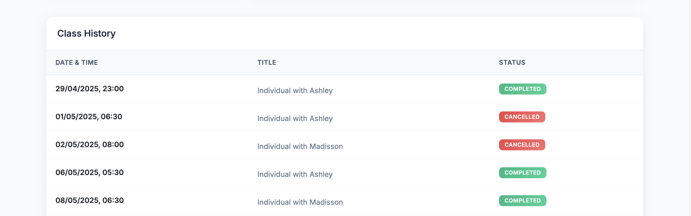

# talktalk-bot

Automated Email Notification System for Student Class Progress

> 📊 **Student Dashboard**
> 
> Private information including names, emails, and figures was changed for privacy in this example.
> 
> 
> 
> 
> 

## Overview

This project automates weekly email updates for students about their class progress. It reads student data from a Google Sheet, calculates remaining and completed classes, and sends personalized HTML emails using a custom React component.

## Features

- **Google Sheets Integration:** Fetches student data directly from a spreadsheet.
- **Class Progress Calculation:** Determines each student's remaining and completed classes.
- **Personalized Emails:** Generates custom HTML emails for each student using React.
- **Email Delivery:** Sends emails via Gmail SMTP.

## How It Works

1. **Read Student Data:**  
   The script uses `readGoogleSheet.js` to import student information.

2. **Process Class Info:**  
   `calculateRemainingClasses.js` computes each student's progress.

3. **Render Email Content:**  
   For each student, a personalized email is created using the `MyEmail` React component and rendered to HTML.

4. **Send Emails:**  
   Emails can be sent using Gmail via `sendGmail.js`.

## Usage

1. Install dependencies:
   ```
   npm install
   ```

2. Set up environment variables in a `.env` file (see `.env.example` for required keys).

3. Run the script:
   ```
   npm start
   ```